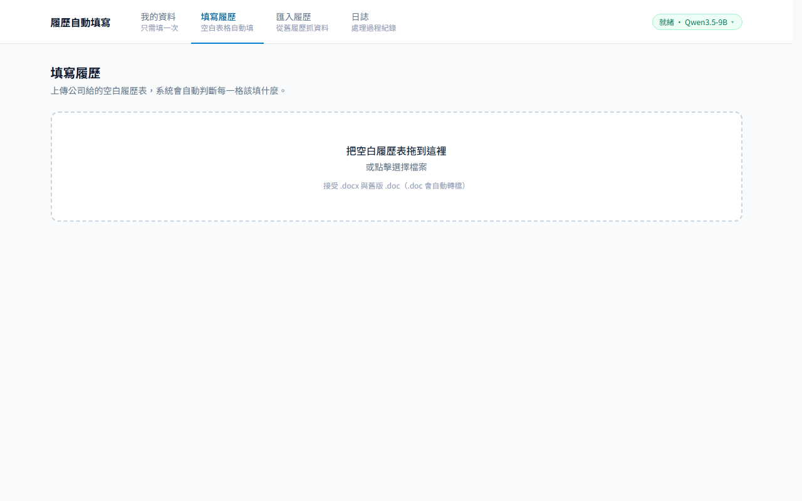

# Resume AutoFill — 履歷自動填寫

**你的資料只填一次，之後任何公司的履歷表都自動填好。**

收到 A 公司的人事資料表、B 公司的應徵登記表？格式都不一樣、欄位名稱五花八門？
把表格丟給 Resume AutoFill，它會自動辨識每一格該填什麼、填進去，
並**完整保留原始版面與字型**。全程在你自己的電腦上執行，履歷不離開本機。



---

## 功能特色

- **填一次，用到底** — 個人資料建立一次，之後每份表格自動取值填寫
- **看得懂各種表格** — 表格、底線填空、勾選框（□■）都能填；欄位名稱寫「姓　名」「應徵者大名」都認得
- **格式完整保留** — 只改文字內容，版面、字型、表格線完全不動
- **填之前先給你看** — 逐格對照預覽，填錯的下拉選單直接改，確認後才下載
- **學過就記住** — 同一份格式第二次上傳，幾秒鐘完成
- **舊履歷直接匯入** — 上傳以前填過的履歷，AI 連同頁面截圖一起判讀，把資料抽出來建檔
- **完全離線** — 除了第一次下載 AI 模型，全程不需要網路；資料不上傳任何伺服器

想看實際效果：[`output/範例_自動填寫成果.docx`](output/範例_自動填寫成果.docx)（內容為虛構資料）。

---

## 系統需求

| 項目 | 需求 |
|---|---|
| 作業系統 | Windows 10 / 11（64 位元） |
| 顯示卡 | **建議 NVIDIA、8 GB VRAM 以上**。無獨顯也能跑（CPU 推論），但一份表格的分析會從約一分鐘變成數十分鐘 |
| 硬碟空間 | 約 8 GB（程式 + AI 模型） |
| 選擇性安裝 | [LibreOffice](https://www.libreoffice.org/download/)（免費）——用於舊版 `.doc` 轉檔、排版預覽與匯入的視覺辨識；沒裝也能用，相關功能會自動改用簡化模式 |

---

## 安裝與啟動

1. 到 [Releases](../../releases) 下載最新的 `Resume_AutoFill.zip`
2. 解壓縮到任何位置（免安裝）
3. 雙擊 **`ResumeAutoFill.exe`** — 瀏覽器會自動開啟操作介面
4. **首次使用**：點右上角「模型未啟動」→ 在 Qwen3.5-9B 按「下載」（約 6 GB，只需一次）→ 下載完按「切換」啟動，等 1～2 分鐘顯示「就緒」即可

之後每次使用都只要雙擊 `ResumeAutoFill.exe`。
要結束程式：工作列右下角系統匣圖示 → 右鍵 → 結束。

---

## 使用方式

介面共四個分頁，正常流程是 **①（或②）建好資料 → ③ 開始填表**：

### ① 我的資料 — 只需填一次

姓名、聯絡方式、學歷、工作經歷、證照專長……分主題填寫，多筆學經歷可自由增減。
這裡是唯一的資料來源，之後所有履歷都從這裡取值。

### ② 匯入履歷 — 建檔捷徑

手上有以前填過的履歷？直接上傳，AI 會把裡面的資料逐欄抽出來，
畫面左邊顯示履歷原稿、右邊顯示抽到的欄位，滑過欄位會在原稿上框出出處。
勾選要匯入的項目、按一下，就寫進「我的資料」——不用手打。

### ③ 填寫履歷 — 日常主功能

1. 上傳公司給的空白履歷表（`.docx` 或舊版 `.doc`）
2. 等待分析（第一次遇到的格式約 1～2 分鐘，畫面會顯示進度）
3. 檢視左右對照預覽：黃底＝將填入的值
4. 有填錯的格子？在對映清單用下拉選單改成正確欄位，預覽立即更新
5. 按「套用並下載」拿到填好的 `.docx`

下載成功後系統會記住這份格式的對映，**同一份表格下次上傳幾秒鐘完成**。

### ④ 日誌

每一步操作的白話紀錄（上傳成功、匯出成功、哪裡失敗），回報問題時把這頁內容附上即可。

---

## 常見問題

**Q：右上角一直顯示「模型未啟動」？**
點開它，確認模型已下載並按「切換」啟動。啟動要載入約 5 GB 到顯示卡，需 1～2 分鐘。

**Q：分析很慢？**
第一次遇到的格式需要 AI 判讀（約 1～2 分鐘），學過的格式幾秒完成。
若你沒有 NVIDIA 顯示卡，是用 CPU 在推論，慢是正常的（見系統需求）。

**Q：預覽顯示不了排版、或 `.doc` 上傳失敗？**
這兩項需要 LibreOffice，裝好後重試即可（免費，見系統需求）。

**Q：有些格子沒填？**
認不出來的格子會**刻意留白**而不是亂填——每間公司不同的內容（如應徵職務）也一律留白讓你手寫。
可以在對映清單手動指定欄位，指定過的下次自動套用。

**Q：我的資料存在哪裡？怎麼完整移除？**
個人資料在 `C:\Users\你的帳號\.resume_autofill`，程式本體就是解壓的資料夾。
兩個都刪掉即完整移除，不留任何東西。

**Q：可以用更強的 AI 模型嗎？**
可以。右上角模型選單提供 27B 與 35B-A3B（需要更多 VRAM），也能貼任意 GGUF 連結使用自訂模型。

---

## 隱私

這是**單機工具**，不是網路服務：

- 所有資料存在本機（SQLite 單一檔案），不上傳任何伺服器
- 介面、後端、AI 引擎都只綁 `localhost`，只有你自己的電腦連得到
- AI 模型跑在你的機器上，履歷內容不經過任何第三方 API
- 要不要填身分證字號等私密欄位，完全由你決定——工具只負責填你提供的資料
- 上傳的履歷檔案 24 小時後自動清除；日誌永遠不記錄個人資料內容

---

## 從原始碼執行（開發者）

```powershell
.\scripts\start-llama-server.ps1                        # 推論引擎（port 8085）
cd frontend; npm install; npm run dev                    # 前端開發伺服器（port 5173）
python -m uvicorn backend.main:app --port 8090 --reload  # 後端（port 8090）
```

架構設計、AI 選型理由、處理流程與打包方式見 **[docs/DEVELOPMENT.md](docs/DEVELOPMENT.md)**。
打包發佈版：`.\scripts\build-package.ps1 -Zip`。

---

## 授權

[MIT License](LICENSE)。

注意：**AI 模型的授權與本專案的授權是兩回事。**預設的 Qwen3.5 為 Apache 2.0（可商用、可散布）；
若自行更換其他模型，請確認該模型卡的授權條款。
